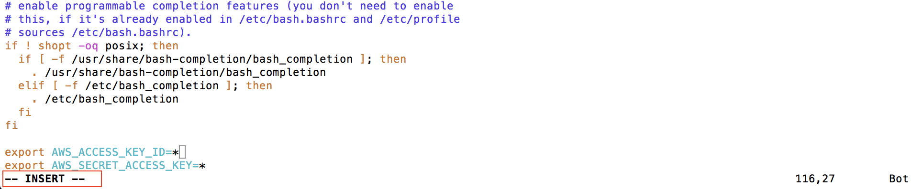

## 安裝 Spark 與登入

### 更新程式
```
sudo apt-get update
```

### 編輯 .bashrc 
Step 1 : 開啟檔案進行編輯
用 vim :
```
vim ~/.bashrc
```
用 nano :
```
nano ~/.bashrc
```

按下 a 進入編輯模式，注意左下角有出現 --INSERT--


Step 2 : 將下面的文字加到 .bashrc 的最下面（將下面的 * 分別換成你自己的 ACCESS KEY ID 以及 ACCESS KEY）
```
export AWS_ACCESS_KEY_ID=*
export AWS_SECRET_ACCESS_KEY=*
```

Step 3 : 離開編輯模式
用 vim :
按下 esc 離開編輯模式
輸入 ":wq" 存擋並且關閉檔案

用 nano :
control + X
輸入 Y 確認修改再按下 enter

Step 4 : 更新設定
```
source ~/.bashrc
```

### 將你的 pem 檔上傳到 ubuntu
到 https://filezilla-project.org/ 安裝 FileZilla

安裝後點選 檔案->站台管理員->新增站台


填入 IP 以及金鑰的路徑之後按下連線

接著將金鑰檔拖到視窗內即完成上傳

連線成功之後可在右下角的視窗看到 ubuntu 上的家目錄


接著將你的金鑰拖移到右下角的視窗中就會開始上傳

上傳之後，你就可以在 ubuntu 上的家目錄中看見你的檔案


### 安裝 Git
```
sudo apt-get install -y git
```

### 下載安裝 spark 所需要的程式
```
git clone https://github.com/amplab/spark-ec2.git
```

### 切換工作路徑到剛才下載的 repository 內
```
cd ~/spark-ec2
```

### 瀏覽在此 repository 下有哪些 branch
```
git branch -a
```


### 切換 Branch 到 branch-2.0
```
git checkout remotes/origin/branch-2.0
```


### 建立一個 cluster
在輸入下面的指令前請先替換以下部分
1. YOUR_KEY 換成你的 pem 檔案的檔名
2. YOUR_CLUSTER_NAME 換成你要的 cluster 名稱


```
./spark-ec2 -k YOUR_KEY -i ~/YOUR_KEY.pem -r ap-northeast-1 -z ap-northeast-1a -t t2.medium -s 1 --spark-version=2.0.0 --hadoop-major-version=yarn launch YOUR_CLUSTER_NAME
```

說明：
-k 金鑰名稱
-i 金鑰位置
-r region (ap-northeast-1 代表東京)
-z zone (ap-northeast-1a 代表東京地區的其中一個  data center)
-t 啟動的機器規格
-s slave 數量

因為建立一個 cluster 大概需要15 ~ 20 分鐘，大家可以先去休息啦！！

### 登入 cluster
注意：這邊的工作路徑仍是在 ~/spark-ec2

這邊一樣要將指令中的一部分文字修改
1. YOUR_KEY 換成你的 pem 檔案的檔名
2. YOUR_CLUSTER_NAME 換成你剛才建立的 cluster 名稱

```
./spark-ec2 -k YOUR_KEY -i ~/YOUR_KEY.pem -r ap-northeast-1 -z ap-northeast-1a login YOUR_CLUSTER_NAME
```

登入 cluster 就會發現我們已經進入 master 的家目錄了

### 關機
注意：下面的指令需要在 master 的機器中輸入

關機的順序是先關閉 spark 再關閉 hadoop（開機時則是相反，先開啟 hadoop 再開啟 spark）
```
~/spark/sbin/stop-all.sh
~/ephemeral-hdfs/sbin/stop-all.sh
```

輸入完上面的指令之後就可以到 AWS Management console 關閉主機啦～～